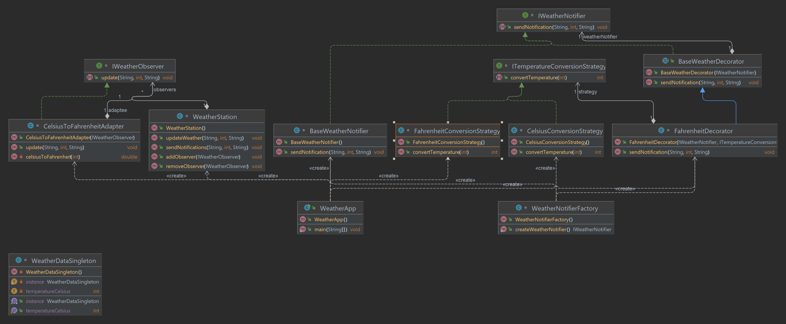

# Final Project of the Software Design Patterns Course | WeatherApp

## Group: SE-2216

## Team members: Azamat Yerezhepbayev, Abylay Amandykov, Merei Isenbai

### Overview

- This project serves as the final assignment for the Software Design Patterns course. It is a Java-based console application, showcasing the implementation of 6 design patterns to create a flexible and modular weather management system.

- The main idea of the project: The WeatherApp aims to provide a comprehensive weather management system, allowing users to observe and update weather conditions, receive notifications, and convert temperatures. The application is designed with a user-friendly command line interface.

- The purpose of the work: The purpose of the WeatherApp is to demonstrate the practical application of design patterns in software development. By putting these patterns into practice, we show how it makes the code flexible and easy to build on, also making the code adaptable, so it can be reused and maintained more efficiently. 

- The objectives of the work: The main objectives of the WeatherApp are to make a user-friendly and easily adaptable weather system. Demonstrate the practical implementation of design patterns (Observer, Decorator, Strategy, Adapter, Singleton, Factory). By using them we're making sure the code is easily extendable and maintainable. Through them we're achieving the practical benefits of design patterns in achieving flexibility, code reusability, and overall software reliability.

## Usage

The WeatherApp class serves as the main entry point for the application. Users can interact with the system through a menu-driven interface. The application provides the following functionalities:

1)	Update Weather for Cities: Allows users to input city names, temperatures, and weather conditions to update the weather data.
2)	Send Notification about Weather Updates: Sends weather notifications using the WeatherNotifier interface. The FahrenheitDecorator ensures temperature conversion to Fahrenheit.
3)	Convert Celsius to Fahrenheit: Converts temperatures from Celsius to Fahrenheit using the FahrenheitConversionStrategy.
4)	Exit: Exits the WeatherApp.


## Design Patterns Used

### Observer Pattern

The Observer pattern is employed to allow various components to receive updates about weather changes. The `WeatherStation` acts as the subject, while classes such as `CelsiusToFahrenheitAdapter` and `FahrenheitDecorator` act as observers.

### Adapter Pattern

The Adapter pattern is utilized in the `CelsiusToFahrenheitAdapter` class to adapt the `WeatherObserver` interface to handle different update parameters.

### Singleton Pattern

The Singleton pattern ensures a single instance of the `WeatherDataSingleton` class, providing a centralized point for storing and accessing weather data.

### Strategy Pattern

The Strategy pattern is implemented through the `TemperatureConversionStrategy` interface, with `CelsiusConversionStrategy` and `FahrenheitConversionStrategy` as concrete strategies. The `WeatherApp` class uses these strategies for temperature conversion.

### Decorator Pattern

The Decorator pattern is employed in the `FahrenheitDecorator` class, allowing dynamic extension of the `BaseWeatherNotifier` class with additional behavior. This pattern enhances the notification system with temperature conversion.

### Factory Pattern

The Factory pattern is used to create instances of the `WeatherNotifier` interface with the help of the `WeatherNotifierFactory` class. This pattern abstracts the creation of `WeatherNotifier` instances, providing flexibility for future extensions.

## Other Classes and Interfaces

### WeatherObserver Interface

The `WeatherObserver` interface defines the contract for objects that need to be notified about weather updates. It has a method `update(String cityName, int temperatureCelsius, String weatherConditions)`.

```java
interface IWeatherObserver {
    void update(String cityName, int temperatureCelsius, String weatherConditions);
}
```

### WeatherNotifier Interface

The `WeatherNotifier` interface defines the contract for classes responsible for sending weather notifications. It has a method `sendNotification(String cityName, int temperatureCelsius, String weatherConditions)`.

```java
interface IWeatherNotifier {
    void sendNotification(String cityName, int temperatureCelsius, String weatherConditions);
}
```

### BaseWeatherNotifier Class

The `BaseWeatherNotifier` class is a concrete implementation of the `WeatherNotifier` interface, providing basic notification functionality.

```java
class BaseWeatherNotifier implements IWeatherNotifier {
    @Override
    public void sendNotification(String cityName, int temperatureCelsius, String weatherConditions) {
        System.out.println("Weather notification sent for " + cityName +
                ": Temperature (Celsius): " + temperatureCelsius + ", Conditions: " + weatherConditions);
    }
}
```

### CelsiusToFahrenheitAdapter Class

The `CelsiusToFahrenheitAdapter` class adapts the `WeatherObserver` interface to handle different update parameters. It converts Celsius to Fahrenheit and then calls the `update` method.

```java
class CelsiusToFahrenheitAdapter implements IWeatherObserver {
    private IWeatherObserver adaptee;

    public CelsiusToFahrenheitAdapter(IWeatherObserver adaptee) {
        this.adaptee = adaptee;
    }

    @Override
    public void update(String cityName, int temperatureCelsius, String weatherConditions) {
        double temperatureFahrenheit = celsiusToFahrenheit(temperatureCelsius);
        adaptee.update(cityName, (int) temperatureFahrenheit, weatherConditions);
    }

    private double celsiusToFahrenheit(int temperatureCelsius) {
        return (temperatureCelsius * 9.0 / 5.0) + 32;
    }
}
```

### FahrenheitConversionStrategy Class

The `FahrenheitConversionStrategy` class is a concrete implementation of the `TemperatureConversionStrategy` interface, providing a strategy for converting temperatures to Fahrenheit.

```java
class FahrenheitConversionStrategy implements ITemperatureConversionStrategy {
    @Override
    public int convertTemperature(int temperatureCelsius) {
        return (int) ((temperatureCelsius * 9.0 / 5.0) + 32);
    }
}
```

### WeatherDataSingleton Class

The `WeatherDataSingleton` class ensures a single instance for storing and accessing weather data. It is responsible for holding the current temperature in Celsius.

```java
class WeatherDataSingleton {
    private static WeatherDataSingleton instance;
    private int temperatureCelsius;
    private WeatherDataSingleton() {
    }

    public static synchronized WeatherDataSingleton getInstance() {
        if (instance == null) {
            instance = new WeatherDataSingleton();
        }
        return instance;
    }
    public int getTemperatureCelsius() {
        return temperatureCelsius;
    }
    public void setTemperatureCelsius(int temperatureCelsius) {
        this.temperatureCelsius = temperatureCelsius;
    }
}
```

### WeatherStation Class

The `WeatherStation` class acts as the subject in the Observer pattern. It manages a list of observers (`WeatherObserver` instances) and notifies them about weather updates. It has methods for updating weather and sending notifications.

```java
import java.util.ArrayList;
import java.util.List;

class WeatherStation {
    private List<IWeatherObserver> observers = new ArrayList<>();
    public void addObserver(IWeatherObserver observer) {
        observers.add(observer);
    }
    public void removeObserver(IWeatherObserver observer) {
        observers.remove(observer);
    }
    public void updateWeather(String cityName, int temperatureCelsius, String weatherConditions) {
        for (IWeatherObserver observer : observers) {
            observer.update(cityName, temperatureCelsius, weatherConditions);
        }
    }
    public void sendNotifications(String cityName, int temperatureCelsius, String weatherConditions) {
        for (IWeatherObserver observer : observers) {
            observer.update(cityName, temperatureCelsius, weatherConditions);
        }
    }
}
```

### CelsiusConversionStrategy Class

The `CelsiusConversionStrategy` class is a concrete implementation of the `TemperatureConversionStrategy` interface, providing a strategy for converting temperatures to Celsius.

```java
class CelsiusConversionStrategy implements ITemperatureConversionStrategy {
    @Override
    public int convertTemperature(int temperatureCelsius) {
        return temperatureCelsius;
    }
}
```

### WeatherApp Class

The `WeatherApp` class contains the main method and implements the console application. It handles user input, updates weather, and sends notifications based on user choices.

```java
import java.util.Scanner;

public class WeatherApp {
    public static void main(String[] args) {
        WeatherDataSingleton weatherData = WeatherDataSingleton.getInstance();
        WeatherStation weatherStation = new WeatherStation();
        // Observer Pattern

        IWeatherObserver consoleObserver = (cityName, temperature, weatherConditions) -> {
            System.out.println("Current weather in " + cityName + ": Temperature (Celsius): " + temperature + ", Conditions: " + weatherConditions);
        };
        IWeatherObserver notificationObserver = (cityName, temperature, weatherConditions) -> {
            IWeatherNotifier weatherNotifier = WeatherNotifierFactory.createWeatherNotifier();
            weatherNotifier.sendNotification(cityName, temperature, weatherConditions);
        };

        IWeatherNotifier baseWeatherNotifier = new BaseWeatherNotifier();
        IWeatherNotifier fahrenheitDecorator = new FahrenheitDecorator(baseWeatherNotifier, new FahrenheitConversionStrategy());

        weatherStation.addObserver(new CelsiusToFahrenheitAdapter(consoleObserver));
        weatherStation.addObserver(new CelsiusToFahrenheitAdapter(notificationObserver));

        // Menu
        Scanner scanner = new Scanner(System.in);
        int choice;

        do {
            System.out.println("\nWeather Updating Administration");
            System.out.println("1. Update Weather for Cities");
            System.out.println("2. Send Notification about Weather Updates");
            System.out.println("3. Convert Celsius to Fahrenheit");
            System.out.println("4. Exit");

            System.out.print("Enter your choice: ");
            choice = scanner.nextInt();

            switch (choice) {
                case 1:
                    System.out.print("Enter the city name: ");
                    String cityName = scanner.next();
                    System.out.print("Enter the temperature in Celsius: ");
                    int temperature = scanner.nextInt();
                    System.out.print("Enter weather conditions: ");
                    String weatherConditions = scanner.next();
                    weatherData.setTemperatureCelsius(temperature);
                    System.out.println("Weather updated");
                    break;

                case 2:
                    System.out.print("Enter the city name: ");
                    cityName = scanner.next();
                    System.out.print("Enter the temperature in Celsius: ");
                    temperature = scanner.nextInt();
                    System.out.print("Enter weather conditions: ");
                    weatherConditions = scanner.next();

                    // Use FahrenheitDecorator to fahrenheit conversion
                    IWeatherNotifier weatherNotifier = new FahrenheitDecorator(baseWeatherNotifier, new FahrenheitConversionStrategy());
                    weatherNotifier.sendNotification(cityName, temperature, weatherConditions);
                    break;


                case 3:
                    System.out.print("Enter the temperature in Celsius: ");
                    int celsiusTemperature = scanner.nextInt();
                    ITemperatureConversionStrategy conversionStrategy = new FahrenheitConversionStrategy();
                    int convertedTemperature = conversionStrategy.convertTemperature(celsiusTemperature);
                    System.out.println("Temperature in Fahrenheit: " + convertedTemperature);
                    break;

                case 4:
                    System.out.println("Exiting Weather App.");
                    break;

                default:
                    System.out.println("Invalid choice.");
            }

        } while (choice != 4);
    }
}
```

### UML Diagram



## Conclusion

- Summary: The WeatherApp project, consisting of 13 classes, successfully implemented 6 design patterns, including Observer, Decorator, Strategy, Adapter, Singleton, and Factory, to create a flexible and user-friendly weather management system. We were able to achieve all our initial plans, the application allows users to observe and update weather conditions, receive notifications, and if need correctly convert temperatures.

- Challenges faced: Working in a team of three had its own challenges. Making sure everyone used design patterns consistently and merging our work smoothly needed clear communication. Setting coding rules, having regular meetings, and checking each other's code helped us work together. Even with challenges, teamwork was crucial, bringing in different ideas. It was a great experience that sets the stage for future improvements and more teamwork.

- Future improvements:  There are several ways to make the WeatherApp even better. One idea is to add more ways to get weather notifications, like through email or text messages. We could also explore including more weather features to make the app more useful. Improving the look and feel of the app's interface, adding GUI would make it even more user-friendly. And if we can get real-time weather data from external sources, that would be a big plus. These improvements would enhance the app's capabilities and user experience, making it even more practical and enjoyable to use.

## References

- https://refactoring.guru/design-patterns/adapter
- https://refactoring.guru/design-patterns/decorator
- https://refactoring.guru/design-patterns/factory-method
- https://refactoring.guru/design-patterns/observer
- https://refactoring.guru/design-patterns/singleton
- https://refactoring.guru/design-patterns/strategy
- https://www.w3schools.com/java/


